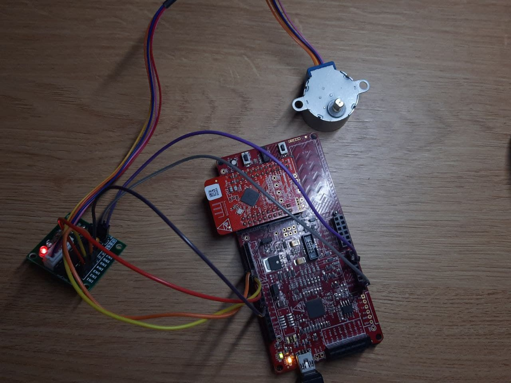
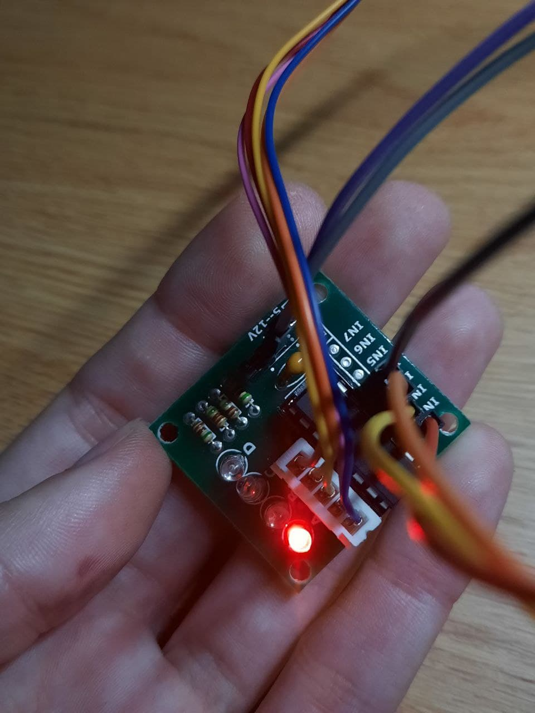
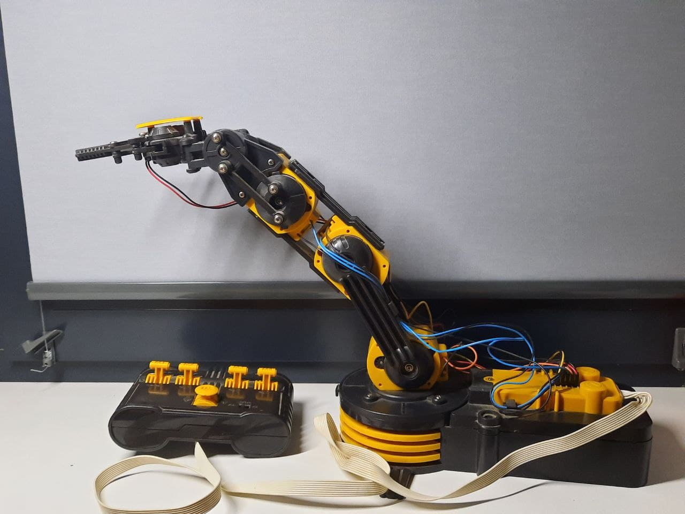
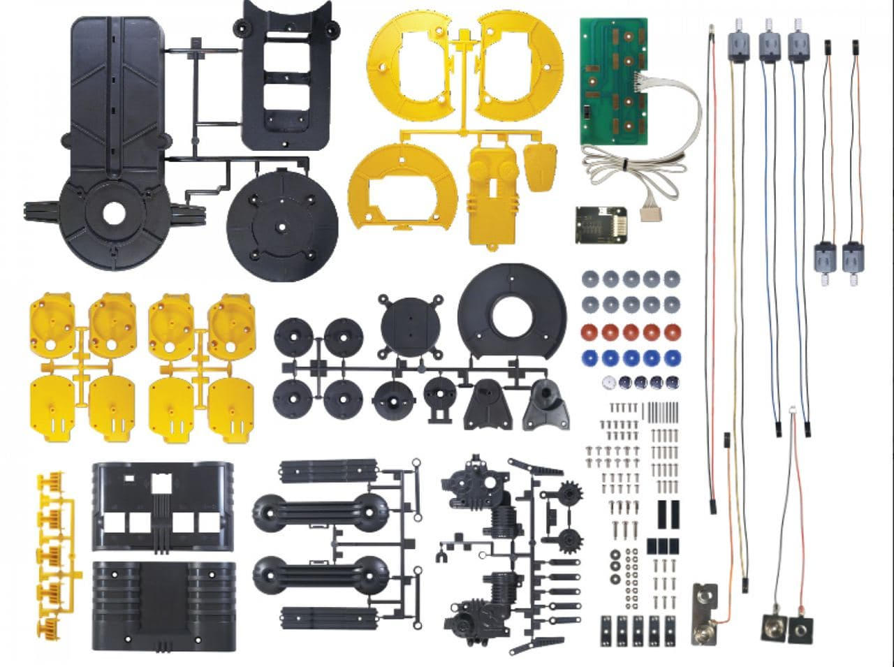
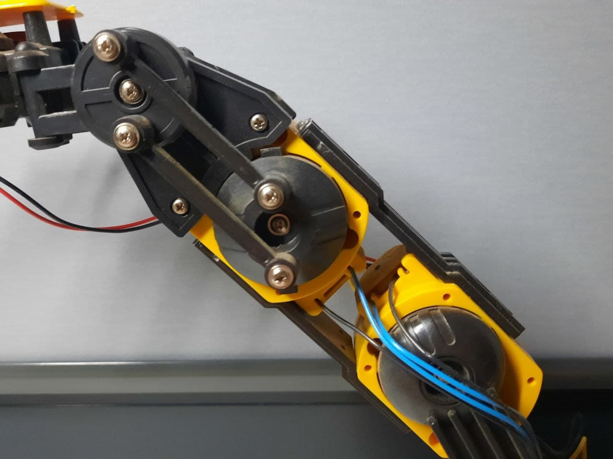
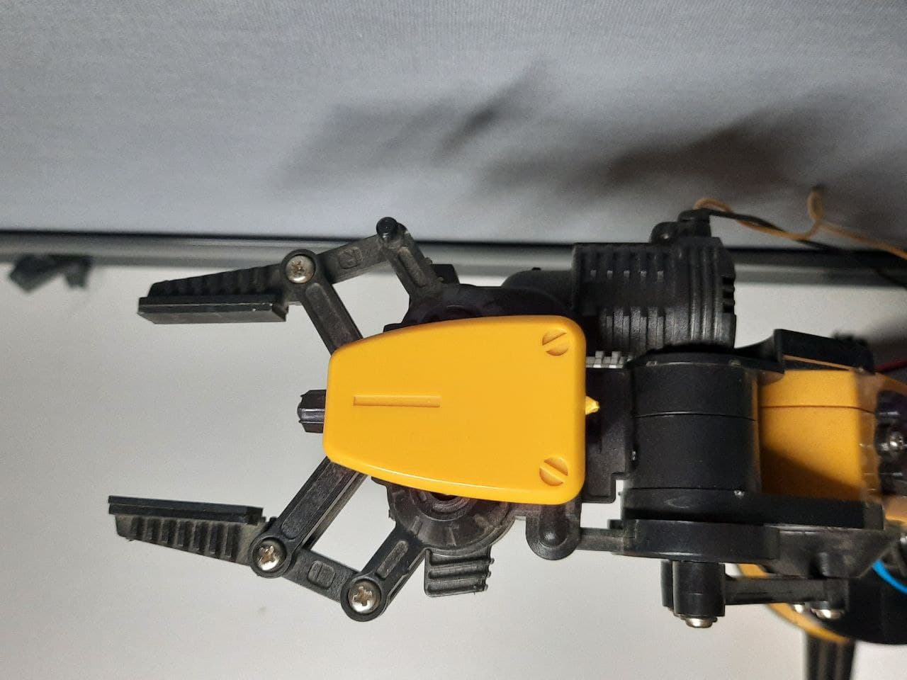

# Robot Manipulator (ARM) project

## Done by:
* [Shevchuk Bohdan](https://github.com/shevdan)
 
* [Brovchenko Yaroslav](https://github.com/firstgenius)

* [Kuzmina Daria](https://github.com/ivddorrka)

## Tech Parts

> The project will be made using PSoC microcontroller, as a base board. 

> Currently the work is at the stage of controlling a stepper motor 28byj-48 via PSoC4. The tech side of it can be seen on the next photo: 

> The stepper motor is being connected to the stepper motor driver:

> Via which the stepper is connected to the PSoC. 

## Usage

> The PSoC is being programmed via the PSoC Creator. In order not to make this repo too heavy we've uploaded only the main.c file which is the "logic" for now. 

> A, B, C, D - are digital output pins on the PSoC board which connect IN1, IN2, IN3, IN4 from the stepper motor driver.

> So if you-d like to use this project and try it out - check out the main.c file.

###### IMPORTANT!

> There's a math.h include being used. In order to use it simply follow this steps: 
> In Creator go to Project -> Build Settings -> Linker -> General. Add "m" (without the quotes) into Additional Libraries.

###### About the code 

> Running this code will make motor will move 90 degree outer clockwise (direction = 1) and then after a short delay 90 degree clockwise (direction = -1)

> There's a short video how it looks like 
* CLICK ON THE PICTURE, SO YOU'LL BE REDIRECTED TO YOUTUBE 
> (here it firstly rotates 360 degree on the one side and then 90 degree back)

## Future steps to be taken 

> We're making a program and hardware to be able to make a robo-manipulator arm run specific algorithm. Firstly we'll proceed working with stepper motors 
> One of the first steps is providing control of the robot manipulator by transmitting instructions to the PSoC4200 microcontroller.

> We have a totally mechanic robot-manipulator, which is being controlled from the remote controll which is connected to it.

> If we look at which parts this robot consists of, we'll see that the main work of moving is being done by the stepper motors, so the algorithm should be using these stepper motors one by one, making them rotate the arm in the needed direction. Such algorith can make this arm a perfect helper for everyday. 

* The part:

* Where some of this motors are being located at:

> As soon as we'll get it done, we'll proceed working with the big robot manipulator, which is way bigger that this try-one and able to pick up things up to 4-5 kg. The big one arm is being constructed at the moment. 

