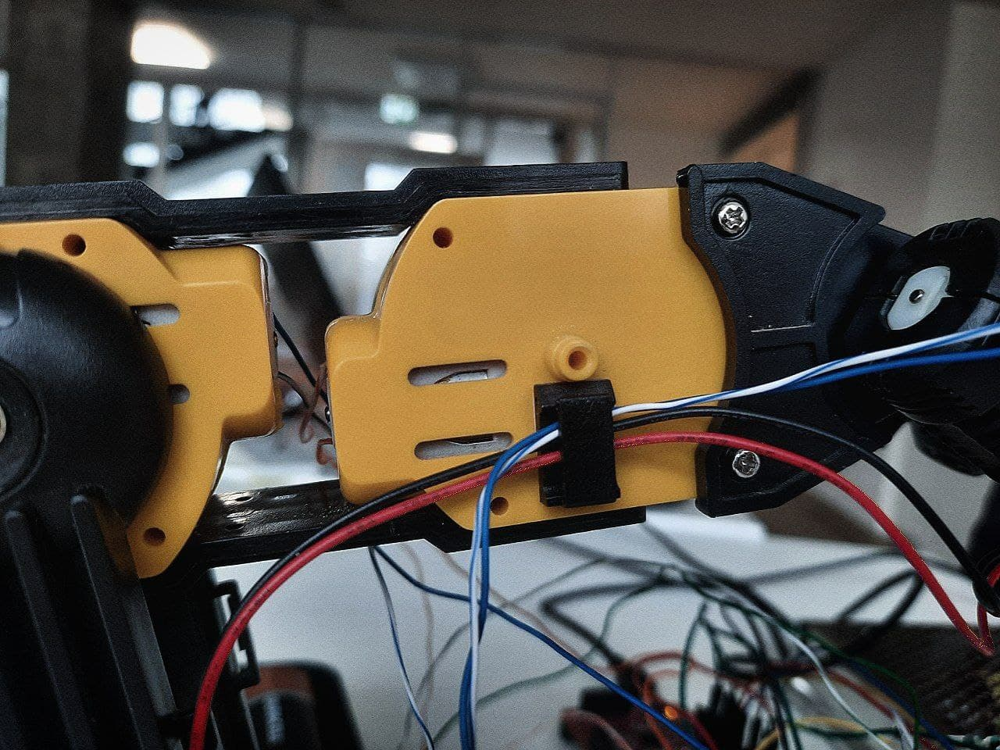
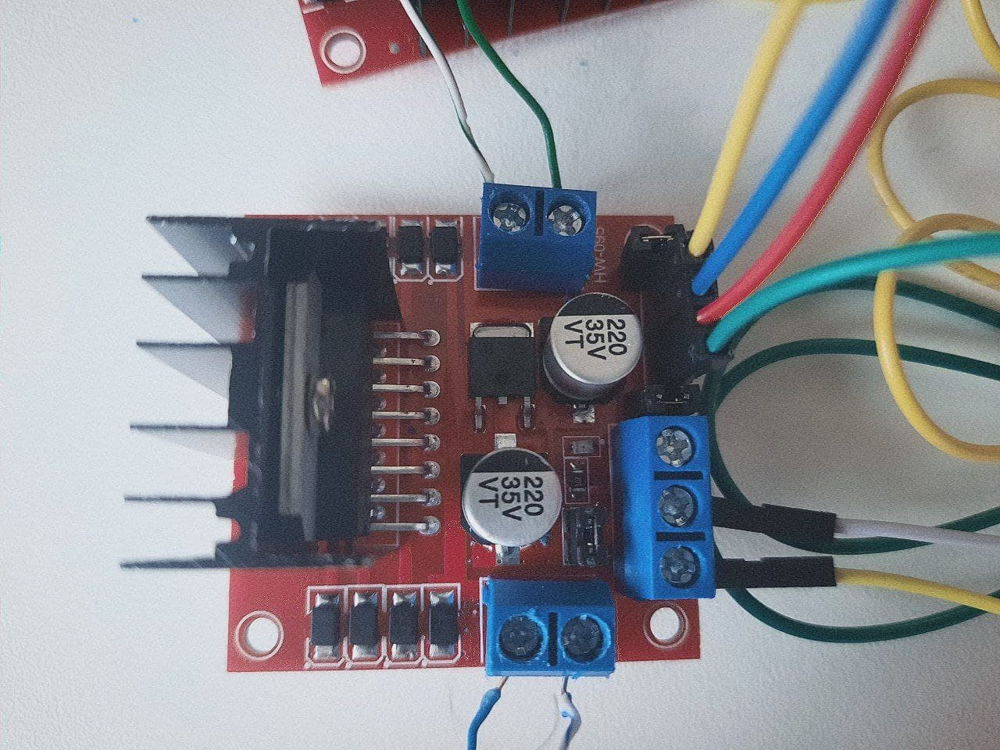
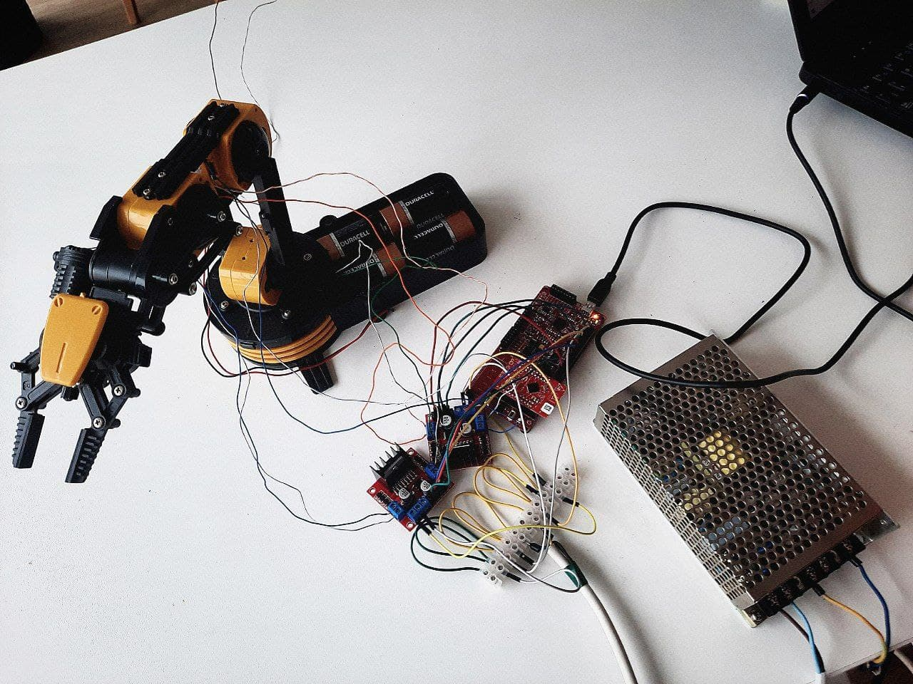

## The second part of our work on project

Last time we've worked with sepper motors, however we have a robo-arm with DC-motors. 
* We've taken them all out to get a closer look on them and to connect to the onvenient wires to connect to the microcontroller later. (We're using psoc 4 ble cy8c424BLQI-BL583)

* As we were done with connecting all the wires to the needed motors we've assembled everything back to the initial condition and connected motors to the MC via drivers:

* Motors inside the constructor:

* Connection to the drivers:

* Whole look of everything now

